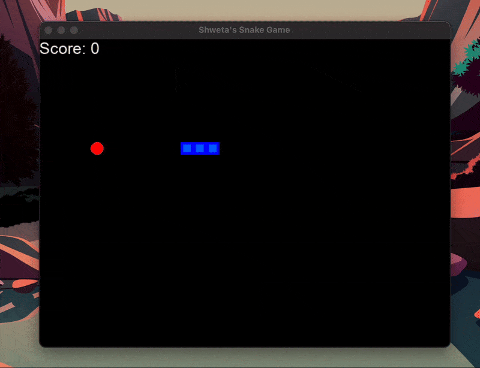

I created a Python snake game, which I then used to learn about reinforcement learning and teach the snake (agent) how to navigate across its environment with limited obstacles. 

The environment and its constraints:
1. The Snake has its food that it eats to get a reward of +10
2. The game ends if the snake goes out of the boundary of the game/ tries to eat itself, and gets a negative reward of -10

The state variable consists of elements that help describe the environment to the snake (agent).  
It consists of things like 
1. Is the danger straight ahead of us, or to the left/ right, given our current state?   
2. What direction are we moving in?
3. Finally, relative to our position, where is the food placed? 

Below, you can see a small snippet of how the GUI looks when the agent is taking its own independent decisions.

The goal was to gain a deeper understanding of how agents operate in an RL environment. 
I learned about the Bellman Equation and used it, along with MSE as a criterion (loss), in a simple FFD NN. 
The NN is simple; it has just one hidden layer. 

The main logic of the Bellman Equation is listed below, which I used: 

 Q = model.predict(state0)  
newQ = reward + gamma * max(Q(state1)) 

